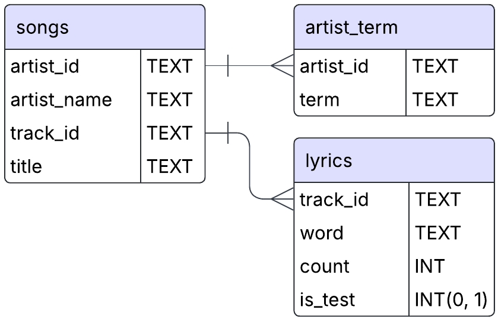
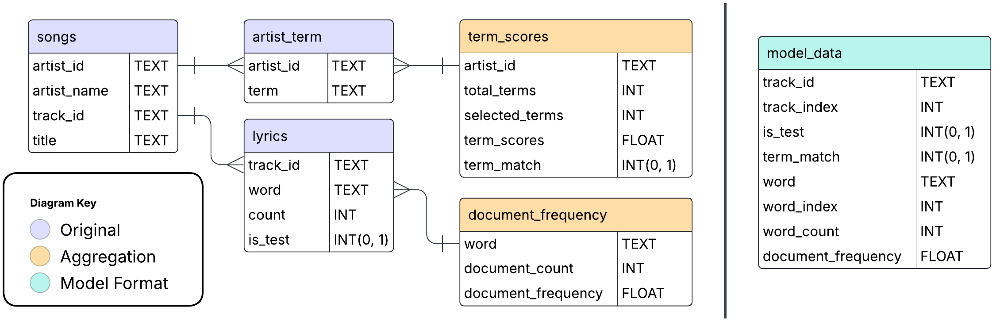

[<< Back to Detector](detector.md)<br>
&nbsp;&nbsp;&nbsp;[Pt 2 - Training The Model >>](pt2-training-the-model.md)

## Pt 1 - Getting The Data
In this section we will...
- Download sqlite database from Kaggle
- Preview / Explain the data
- Create & save aggregations

## The Million Song Dataset
For this project, we use the [Million Song Dataset](http://millionsongdataset.com/), first published in 2011. Because the dataset is not actively being maintained (some features over time have disappeared from the website), I uploaded a publicly available backup of the features I'll be using to Kaggle. The code below will download the data from there.

There's a lot more data available than what I'm using here, so if this project whets your appetite for machine learning on music data you should check out the link.

## Download the Data


```python
# Import libraries
import kagglehub
import os

# Set kaggle download folder to the current working directly.
os.environ["KAGGLEHUB_CACHE"] = os.getcwd()

# Download from Kaggle
download_path = kagglehub.dataset_download("kfoster150/million-song-dataset-metadata-lyrics-terms")
db_path = os.path.join(download_path, 'millionsong.db')
```

    Downloading from https://www.kaggle.com/api/v1/datasets/download/kfoster150/million-song-dataset-metadata-lyrics-terms?dataset_version_number=1...
    

    100%|███████████████████████████████████████████████████████████████████████████████| 243M/243M [02:24<00:00, 1.76MB/s]

    Extracting files...
    

    
    

## Original Data


```python
import sqlite3
import pandas as pd

conn = sqlite3.connect(db_path)

songs_sample = pd.read_sql("select * from songs limit 100", con=conn)
artist_term_sample = pd.read_sql("select * from artist_term limit 100", con=conn)
lyrics_sample = pd.read_sql("select * from lyrics limit 100", con=conn)

conn.close()
```

### table: songs
Contains the song title and artist name, and unique ID's for each of these features


```python
songs_sample.sample(5)
```


<div>
<style scoped>
    .dataframe tbody tr th:only-of-type {
        vertical-align: middle;
    }

    .dataframe tbody tr th {
        vertical-align: top;
    }

    .dataframe thead th {
        text-align: right;
    }
</style>
<table border="1" class="dataframe">
  <thead>
    <tr style="text-align: right;">
      <th></th>
      <th>artist_id</th>
      <th>artist_name</th>
      <th>track_id</th>
      <th>title</th>
    </tr>
  </thead>
  <tbody>
    <tr>
      <th>37</th>
      <td>AR3TG9F1187B98E0D3</td>
      <td>Wishbone Ash</td>
      <td>TRMMMKN12903CB44A5</td>
      <td>Wonderful Stash</td>
    </tr>
    <tr>
      <th>35</th>
      <td>AR0G47L1187B98CC6D</td>
      <td>Frank Chacksfield</td>
      <td>TRMMMPU128F42B134D</td>
      <td>Cockleshell Heroes</td>
    </tr>
    <tr>
      <th>36</th>
      <td>ARQJYSJ1187FB4CDF3</td>
      <td>Voyage</td>
      <td>TRMMMYP128F429A5E4</td>
      <td>Trancesequence</td>
    </tr>
    <tr>
      <th>84</th>
      <td>AR73P6T1187B994881</td>
      <td>Diablo Swing Orchestra</td>
      <td>TRMMWQU12903CF447F</td>
      <td>Lucy Fears the Morning Star</td>
    </tr>
    <tr>
      <th>66</th>
      <td>ARNFVG61187FB3EB6C</td>
      <td>JOHN DOE</td>
      <td>TRMMWRC128F93647F7</td>
      <td>Suffer</td>
    </tr>
  </tbody>
</table>
</div>


### table: artist_term
Contains terms associated with the unique ID of the artist


```python
artist_term_sample.sample(5)
```


<div>
<style scoped>
    .dataframe tbody tr th:only-of-type {
        vertical-align: middle;
    }

    .dataframe tbody tr th {
        vertical-align: top;
    }

    .dataframe thead th {
        text-align: right;
    }
</style>
<table border="1" class="dataframe">
  <thead>
    <tr style="text-align: right;">
      <th></th>
      <th>artist_id</th>
      <th>term</th>
    </tr>
  </thead>
  <tbody>
    <tr>
      <th>64</th>
      <td>AR006821187FB5192B</td>
      <td>bass</td>
    </tr>
    <tr>
      <th>22</th>
      <td>AR002UA1187B9A637D</td>
      <td>garage</td>
    </tr>
    <tr>
      <th>20</th>
      <td>AR002UA1187B9A637D</td>
      <td>english</td>
    </tr>
    <tr>
      <th>23</th>
      <td>AR002UA1187B9A637D</td>
      <td>garage rock revival</td>
    </tr>
    <tr>
      <th>88</th>
      <td>AR006821187FB5192B</td>
      <td>rock</td>
    </tr>
  </tbody>
</table>
</div>


### table: lyrics
For each track and word found in that track, a count of that word is listed. This is known as a 'Bag-of-Words' format. There is also a binary `is_test` column to split tracks into a train and test set.

**Notes:**
- These are word "stems", not the exact word from the lyrics. For example, 'cry', 'cried', and 'crying' are all mapped to the same stem: 'cri'.
- Only the 5,000 most common word stems across the entire corpus were used.

More info is available on the webpage for [MSD/MusixMatch](http://millionsongdataset.com/musixmatch/)


```python
lyrics_sample.sample(5)
```


<div>
<style scoped>
    .dataframe tbody tr th:only-of-type {
        vertical-align: middle;
    }

    .dataframe tbody tr th {
        vertical-align: top;
    }

    .dataframe thead th {
        text-align: right;
    }
</style>
<table border="1" class="dataframe">
  <thead>
    <tr style="text-align: right;">
      <th></th>
      <th>track_id</th>
      <th>word</th>
      <th>count</th>
      <th>is_test</th>
    </tr>
  </thead>
  <tbody>
    <tr>
      <th>66</th>
      <td>TRAAAAV128F421A322</td>
      <td>devast</td>
      <td>1</td>
      <td>0</td>
    </tr>
    <tr>
      <th>44</th>
      <td>TRAAAAV128F421A322</td>
      <td>ignor</td>
      <td>1</td>
      <td>0</td>
    </tr>
    <tr>
      <th>13</th>
      <td>TRAAAAV128F421A322</td>
      <td>are</td>
      <td>2</td>
      <td>0</td>
    </tr>
    <tr>
      <th>32</th>
      <td>TRAAAAV128F421A322</td>
      <td>someon</td>
      <td>1</td>
      <td>0</td>
    </tr>
    <tr>
      <th>67</th>
      <td>TRAAAAV128F421A322</td>
      <td>element</td>
      <td>1</td>
      <td>0</td>
    </tr>
  </tbody>
</table>
</div>


**Original Data Relationship Diagram**

<div>

</div>

## New Aggregations
### The Document Frequency Table
We can filter out words that are either too common or too rare to be useful. For this we create a `document_frequency` table from the `lyrics` table, to reference what percentage of documents (i.e. songs) contain the word. It can take a minute to calculate, but will be much faster to do it now in SQL rather than filter it out later through other means.


```python
# document frequency
df_query = """
create table document_frequency as
with corpus_size as (
	select 1.0*count(distinct track_id) as corpus_size
	from lyrics
)

, document_count as (
	select word, count(distinct track_id) as document_count
	from lyrics
	group by word
)

select 
	word, document_count, 
	1.0*document_count/(select corpus_size from corpus_size) as document_frequency
from document_count
"""

conn = sqlite3.connect(db_path)
curs = conn.cursor()

# Skip creating the table if it already exists.
try:
    curs.execute(df_query)
    print("table created")
except sqlite3.OperationalError as e:
    print(e)
    print("skipping creation")

conn.close()
```

    table created
    

### table: document_frequency


```python
conn = sqlite3.connect(db_path)
df_sample = pd.read_sql("select * from document_frequency limit 100", con=conn)
conn.close()
df_sample.sample(5)
```


<div>
<style scoped>
    .dataframe tbody tr th:only-of-type {
        vertical-align: middle;
    }

    .dataframe tbody tr th {
        vertical-align: top;
    }

    .dataframe thead th {
        text-align: right;
    }
</style>
<table border="1" class="dataframe">
  <thead>
    <tr style="text-align: right;">
      <th></th>
      <th>word</th>
      <th>document_count</th>
      <th>document_frequency</th>
    </tr>
  </thead>
  <tbody>
    <tr>
      <th>43</th>
      <td>acabar</td>
      <td>282</td>
      <td>0.001187</td>
    </tr>
    <tr>
      <th>66</th>
      <td>ador</td>
      <td>1411</td>
      <td>0.005937</td>
    </tr>
    <tr>
      <th>57</th>
      <td>adam</td>
      <td>444</td>
      <td>0.001868</td>
    </tr>
    <tr>
      <th>81</th>
      <td>ago</td>
      <td>3628</td>
      <td>0.015265</td>
    </tr>
    <tr>
      <th>30</th>
      <td>abandon</td>
      <td>1023</td>
      <td>0.004304</td>
    </tr>
  </tbody>
</table>
</div>


## Identifying Death Metal
For each artist, there is a set of terms associated with them. Things like 'rock', 'jazz', 'new york' and more. But, they aren't always accurate, and not just because music genres can be subjective. Some artists have nothing to do with death metal, or even rock music in general, but still have the "death metal" term. The dataset used to have confidence scores for each term to filter for cases like these, but that no longer exists anywhere I could find.

To work around this, we create a `term_scores` table, with a `term_match` column, which equals 1 for artists where the average ratio of terms containing "death" or "metal" is at least 20%, and 0 if not. This leaves in some artists that may not purely fit the subgenre, but tends to eliminate artists with no actual affiliation with metal.

If you want to experiment and try to find another genre that the model can detect, the script below will adapt to different terms. Just change the strings in the `terms` list to whatever you want, like `['reggae']` or `['los angeles', 'punk']`. Otherwise, just run it as is.


```python
# Optional: Change terms
terms = ['death', 'metal']

# Optional: Change threshold
threshold = 0.2

# Add wildcards to terms
terms = ['%' + term + '%' for term in terms]

# Assemble query
query_a = """
create table term_scores as
with total_term_count as (
	select artist_id, count(TERM)*1.0 as total_terms
	from artist_term
	group by artist_id
)

, selected_term_count as (
	select artist_id, count(term)*1.0 as selected_terms
	from artist_term"""

# Programmatically create the WHERE clause
# to adapt to however many terms are supplied
query_b = """
    where term like ?"""

if len(terms) > 1:
    for term in terms[1:]:
        query_b += """
    or term like ?"""


query_c = """
    group by artist_id
)

, merges as (
	select
            a.artist_id,
            total_terms, 
            ifnull(selected_terms, 0.0) as selected_terms

	from total_term_count a
	
	left join selected_term_count b
	on a.artist_id = b.artist_id
)

select *,
    selected_terms/total_terms/? as term_score,
	case 
        when selected_terms/total_terms/? > ? then 1
    else 0
	end as term_match
from merges
"""

# concatenate the query parts
term_query = query_a + query_b + query_c

# Assemble parameters
parameters = (*tuple(terms), len(terms), len(terms), threshold, )

conn = sqlite3.connect(db_path)
curs = conn.cursor()

# Skip creating the table if it already exists.
try:
    curs.execute(term_query, parameters)
    print("table created")
except sqlite3.OperationalError as e:
    print(e)
    print("skipping creation")

conn.close()
```

    table created
    

### table: term_scores


```python
conn = sqlite3.connect(db_path)
term_scores_sample = pd.read_sql("select * from term_scores limit 100", con=conn)
conn.close()
```


```python
term_scores_sample.sample(5)
```


<div>
<style scoped>
    .dataframe tbody tr th:only-of-type {
        vertical-align: middle;
    }

    .dataframe tbody tr th {
        vertical-align: top;
    }

    .dataframe thead th {
        text-align: right;
    }
</style>
<table border="1" class="dataframe">
  <thead>
    <tr style="text-align: right;">
      <th></th>
      <th>artist_id</th>
      <th>total_terms</th>
      <th>selected_terms</th>
      <th>term_score</th>
      <th>term_match</th>
    </tr>
  </thead>
  <tbody>
    <tr>
      <th>32</th>
      <td>AR013KN1187FB5AC4C</td>
      <td>13.0</td>
      <td>0.0</td>
      <td>0.0000</td>
      <td>0</td>
    </tr>
    <tr>
      <th>54</th>
      <td>AR01SXQ119B86698DC</td>
      <td>16.0</td>
      <td>10.0</td>
      <td>0.3125</td>
      <td>1</td>
    </tr>
    <tr>
      <th>97</th>
      <td>AR035X11187B996BB9</td>
      <td>37.0</td>
      <td>0.0</td>
      <td>0.0000</td>
      <td>0</td>
    </tr>
    <tr>
      <th>13</th>
      <td>AR00GVV11C8A415A54</td>
      <td>10.0</td>
      <td>0.0</td>
      <td>0.0000</td>
      <td>0</td>
    </tr>
    <tr>
      <th>27</th>
      <td>AR00RBU1187B9B3F1F</td>
      <td>34.0</td>
      <td>0.0</td>
      <td>0.0000</td>
      <td>0</td>
    </tr>
  </tbody>
</table>
</div>


### Preparing Data For Sparse Matrix
The last table will translate each track, word, the word count for that track, and label (death metal or not) into numerical indices. This way, the data can be transformed into a `sparse_matrix`, which can be processed much more efficiently than a dense table when most of the features (words) have no value.

**Sparse Matrix diagram**<br>

> Source: [GeeksForGeeks.org, Sparse Matrix and its representations](https://www.geeksforgeeks.org/sparse-matrix-representation/)

Imagine a giant spreadsheet, with many rows and columns, but where meaningful values are scattered randomly in a small ratio of cells, and the rest are zeros. Most songs will only have a few words associated with them, so we can save a lot of memory by condensing that into a list of relevant coordinates and their value rather than working with an entire table.


```python
# Create model_data table
model_query = """
create table model_data as
with track_index as (
	select track_id,
	row_number() over (order by track_id) - 1 as track_index
	from (select distinct track_id from lyrics)
)

, word_index as (
	select word,
	row_number() over (order by word) - 1 as word_index
	from (select distinct word from lyrics)
)

select 
	ly.track_id, track_index, is_test, term_match,
	ly.word, word_index,
	cast("count" as integer) as word_count,
	document_frequency
from lyrics ly

join songs so
on ly.track_id = so.track_id

join term_scores dms 
on so.artist_id = dms.artist_id

join track_index ti
on ly.track_id = ti.track_id

join word_index wi
on ly.word = wi.word

join document_frequency df
on ly.word = df.word

order by track_index, word_index
"""

conn = sqlite3.connect(db_path)
curs = conn.cursor()

# Skip creating the table if it already exists.
try:
    curs.execute(model_query)
except sqlite3.OperationalError as e:
    print(e)
    print("skipping creation")

conn.close()
```

### model_data


```python
conn = sqlite3.connect(db_path)
model_data_sample = pd.read_sql("select * from model_data limit 500", con=conn)
conn.close()
```


```python
model_data_sample.sample(5)
```


<div>
<style scoped>
    .dataframe tbody tr th:only-of-type {
        vertical-align: middle;
    }

    .dataframe tbody tr th {
        vertical-align: top;
    }

    .dataframe thead th {
        text-align: right;
    }
</style>
<table border="1" class="dataframe">
  <thead>
    <tr style="text-align: right;">
      <th></th>
      <th>track_id</th>
      <th>track_index</th>
      <th>is_test</th>
      <th>term_match</th>
      <th>word</th>
      <th>word_index</th>
      <th>word_count</th>
      <th>document_frequency</th>
    </tr>
  </thead>
  <tbody>
    <tr>
      <th>103</th>
      <td>TRAAABD128F429CF47</td>
      <td>1</td>
      <td>0</td>
      <td>0</td>
      <td>la</td>
      <td>2367</td>
      <td>7</td>
      <td>0.101564</td>
    </tr>
    <tr>
      <th>350</th>
      <td>TRAAAEW128F42930C0</td>
      <td>4</td>
      <td>0</td>
      <td>0</td>
      <td>melt</td>
      <td>2663</td>
      <td>1</td>
      <td>0.008647</td>
    </tr>
    <tr>
      <th>194</th>
      <td>TRAAAED128E0783FAB</td>
      <td>2</td>
      <td>0</td>
      <td>0</td>
      <td>is</td>
      <td>2200</td>
      <td>3</td>
      <td>0.646254</td>
    </tr>
    <tr>
      <th>108</th>
      <td>TRAAABD128F429CF47</td>
      <td>1</td>
      <td>0</td>
      <td>0</td>
      <td>need</td>
      <td>2877</td>
      <td>3</td>
      <td>0.163800</td>
    </tr>
    <tr>
      <th>453</th>
      <td>TRAAAFD128F92F423A</td>
      <td>5</td>
      <td>0</td>
      <td>0</td>
      <td>tire</td>
      <td>4412</td>
      <td>1</td>
      <td>0.029386</td>
    </tr>
  </tbody>
</table>
</div>


### End of Pt 1.

**Original & Aggregated Data Relationships**

<div>

</div>

Now that the SQL database is complete, in the next section we will create the sparse matrix and train the model.

[<< Back to Detector](detector.md)<br>
&nbsp;&nbsp;&nbsp;[Pt 2 - Training The Model >>](pt2-training-the-model.md)<br>


