# Textblob vs Tensorflow for Sentiment Analysis

From the [official TextBlob documentation](https://textblob.readthedocs.io/en/dev/):
> **TextBlob** is a Python (2 and 3) library for processing textual data. It provides a simple API for diving into common natural language processing (NLP) tasks such as part-of-speech tagging, noun phrase extraction, sentiment analysis, classification, translation, and more.

Textblob is indeed, a convenient package. I'm going to rigorously compare its sentiment analysis capabilities against a simple neural network model using the tensorflow library. What I find is that TextBlob's main draw is that it requires very little coding and no training data, as its accuracy is lacking compared to a neural net with **A.** A publicly available text embedding model and **B.** Specific training data for the task at hand.

For this comparison, I use a sample of Amazon product reviews, originally hosted Stanford Network Analysis Project (SNAP), trimmed to a balanced subset by Zheng et al. at NYU, and finally posted for easy access to Kaggle by user Kritanjali Jain [here](https://www.kaggle.com/datasets/kritanjalijain/amazon-reviews).

Starting with a relatively small sample of observations (for practical reasons of computing time), I'll experiment with 6 different combinations of internal activation functions and optimizers. I record and compare the computational speed and prediction accuracy and use these metrics to identify a preferred specification. Finally, I'll run the best performing model one final time on the full dataset and evaluate its performance.

***Sections:***
- [Housekeeping](#housekeeping)
- [Load Data](#Load-Data)
- [TextBlob Benchmark](#textblob-benchmark)
- [Neural Network Experiments](#Neural-Network-Experiments)
- [Final Model](#final-model)

> This notebook is an adaptation of a Machine Learning coursework project for the Master's in Quantitative Economics program at UCLA. The original report, done in collaboration with two other students, can downloaded as a .pdf file <a href="https://github.com/ken-foster/ken-foster.github.io/raw/main/files/Textblob%20vs%20TensorFlow.pdf" download>here</a>.<br><br>The final version of this script was run as a Kaggle Notebook, using their free P100 GPU accelerator. If you'd like to replicate it, I recommend creating a copy using Kaggle from [here](https://www.kaggle.com/code/kfoster150/textblob-vs-tensorflow-for-sentiment-analysis).

# Housekeeping
## Kaggle Logic


```python
# If running on Kaggle, must install TextBlob
# inside the notebook
import os
if os.path.exists(r"/kaggle"):
    os.environ["PIP_ROOT_USER_ACTION"]="ignore"
    os.system("pip install textblob -q")
```

## Load Libraries


```python
# Basic
import json
import shutil
import timeit

# Third-Party
from IPython.display import display
from tqdm.notebook import tqdm
import matplotlib.pyplot as plt
import numpy as np
import pandas as pd
import sklearn
import tensorflow as tf
import tensorflow_hub as hub
import textblob
```

## Matplotlib Options


```python
# Kaggle uses an older version of matplotlib 
# with a different name for the `seaborn` style
if os.path.exists(r"/kaggle"):
    plt.style.use("seaborn")
else:
    plt.style.use("seaborn-v0_8")

plt.rcParams["figure.figsize"] = [7, 5]
plt.rcParams["legend.facecolor"] = "white"
plt.rcParams["legend.frameon"] = True
plt.rcParams["legend.framealpha"] = 0.9
```

# Load Data
## Read from file


```python
# Define function to .csv from Kaggle
def read_amazon_reviews(path):
    df = pd.read_csv(path,header=None,usecols=[0,2],
                     names=["polarity","text"],
                     engine="c")
    df["polarity"] -= 1
    return(df)


if os.path.exists(r"/kaggle"):
    data_path = r"/kaggle/input/amazon-reviews/"
else:
    # May change depending on where you've saved these files
    data_path = r"/data/original/" 

print("Reading Training Data")
train = read_amazon_reviews(data_path + "train.csv")

print("Reading Testing Data")
test = read_amazon_reviews(data_path + "test.csv")
```

    Reading Training Data
    Reading Testing Data
    

## Create Validation Set
Originally, the data is split into train and test sets. I create one more, a validation set with the same number of observations as the test set, by splitting some data off from the train set.

Now there are 3 sets of data that will be applied to our final neural network model:
- **Train**: For training the network
- **Valid**: To check for overfitting while training the network
- **Test**: For doing final tests of accuracy and class recall.


```python
# Get number of test observations 
# (400,000)
n = test.shape[0]

# To validate during training
valid = train[:n].reset_index(drop=True) 

# Re-initialize train object w/out validation observations
train = train[2*n:].reset_index(drop=True) 
```

## Balance Checking
We check that each class, positive and negative, is mostly equally represented in the subsets created.


```python
for data in (train, valid, test):
    print(data["polarity"].value_counts(normalize=True))
```

    0    0.501462
    1    0.498538
    Name: polarity, dtype: float64
    1    0.50517
    0    0.49483
    Name: polarity, dtype: float64
    1    0.5
    0    0.5
    Name: polarity, dtype: float64
    

Each set has about half positive, and half negative reviews.

# Textblob Benchmark
As a general use tool, TextBlob is extremely easy to use. A beginner in the python coding language could run it with minimal difficulties. Textblob is pre-trained and weights for different text inputs cannot be modified, so we go straight to the testing step, and copy the `test` set object for this purpose.

When Textblob is evaluating text for sentiment, it returns a value between -1 and 1 for negative and positive respectively. Because of this, we'll create a new dataframe where the outcome variable matches this pattern, rather than 0 and 1 for negative and positive


```python
# Define function to return the polarity/probability 
# of text as predicted by Textblob
def get_textblob_probability(text):
    return(textblob.TextBlob(text).sentiment.polarity)
```


```python
# Copy test set
tb = test.copy()

# textblob returns -1,1 for neg,pos reviews
tb["true"] = np.where(tb["polarity"] == 1, 1, -1) 

# Drop original column "polarity" since this is
# superseded by column "true" for this purpose
tb.drop(columns = ["polarity"], inplace=True)
```


```python
# Get TextBlob predictions
start = timeit.default_timer()
tb["prob"] = tb["text"].apply(get_textblob_probability)
stop = timeit.default_timer()
```


```python
# Calculate running time
running_time = stop - start

# Print Results and example
print(f"time to run: {running_time/60:.2f} minutes")
print(f"{tb.shape[0]} observations")
print("\nSample of probabilities:")
display(tb.sample(n=5).head())
```

    time to run: 3.78 minutes
    400000 observations
    
    Sample of probabilities:
    


<div>
<style scoped>
    .dataframe tbody tr th:only-of-type {
        vertical-align: middle;
    }

    .dataframe tbody tr th {
        vertical-align: top;
    }

    .dataframe thead th {
        text-align: right;
    }
</style>
<table border="1" class="dataframe">
  <thead>
    <tr style="text-align: right;">
      <th></th>
      <th>text</th>
      <th>true</th>
      <th>prob</th>
    </tr>
  </thead>
  <tbody>
    <tr>
      <th>75526</th>
      <td>Such great songs...."Yer Blues," "Glass Onion,...</td>
      <td>1</td>
      <td>0.106250</td>
    </tr>
    <tr>
      <th>370505</th>
      <td>This item does not smell right. I have purchas...</td>
      <td>-1</td>
      <td>0.178571</td>
    </tr>
    <tr>
      <th>383810</th>
      <td>I found this video enough good to refresh my m...</td>
      <td>1</td>
      <td>0.200000</td>
    </tr>
    <tr>
      <th>208171</th>
      <td>Good album, especially song 4. They need to in...</td>
      <td>1</td>
      <td>0.244444</td>
    </tr>
    <tr>
      <th>81420</th>
      <td>I've read Asimov's later robot novels, which w...</td>
      <td>-1</td>
      <td>-0.004804</td>
    </tr>
  </tbody>
</table>
</div>


## Thresholds for TextBlob
By default, a negative value (less than 0.0) from TextBlob should mean that the text had a negative sentiment, but this is not a given. For example, if the results are too "optimistic", meaning too many observations are predicted as being positive, we may adjust our threshold to consider anything under 0.10 or 0.20 to be a bad sentiment. We create a plot showing how well we detect different sentiments depending on this threshold.


```python
# Create numpy array of thresholds
thresholds = np.arange(-0.5,0.51,step=0.1).round(2)

# Initialize empty lists for accuracy,
# positive class recall and negative 
# class recall
accuracies = []
pos_recalls = []
neg_recalls = []

# Using a loop, populate empty lists
for threshold in thresholds:
    
    # Get prediction conditional on threshold
    tb_pred = np.where(tb["prob"] > threshold, 1, -1)
    
    # Get difference between prediction and ground truth
    # Where difference == 0, the prediction was accurate
    difference = tb_pred - tb["true"]
    results = difference.value_counts()
    accuracy = results.loc[0]/tb.shape[0]

    # Get positive recall
    pos_num = sum((tb["true"] == 1) & (tb_pred == 1))
    pos_den = sum(tb["true"] == 1)
    pos_recall = pos_num/pos_den
    
    # Get negative recall
    neg_num = sum((tb["true"] == -1) & (tb_pred == -1))
    neg_den = sum(tb["true"] == -1)
    neg_recall = neg_num/neg_den
    
    # Append accuracy, positive recall and negative
    # recall to empty lists
    accuracies.append(accuracy)
    pos_recalls.append(pos_recall)
    neg_recalls.append(neg_recall)
    
# Assemble metrics into a dataframe for convenient plotting
tb_results_df = pd.DataFrame({"Threshold":thresholds,
                           "Accuracy":accuracies,
                           "Recall (Pos)":pos_recalls,
                           "Recall (Neg)":neg_recalls})

# Plot performance
tb_results_df.plot.bar(title="TextBlob Performance",
                    x="Threshold")
plt.legend(loc="upper left");
```


    
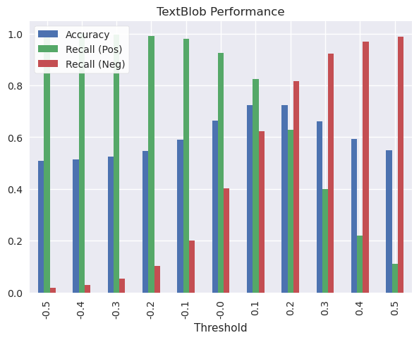
    


At a default threshold of 0, TextBlob catches almost all examples of positive reviews (+90%) but about 40% of negative reviews. Considering the importance of knowing when consumers aren't pleased with their product, these parameters are not acceptable.

The most balanced results are around 0.10-0.20. At this specification, Accuracy and recall for both classes, positive and negative, are in the ballpark of 60-80%, and overall accuracy is 70%. We could micro-manage further and look at thresholds like 0.15, but there's not much more value we'll get out of this model that way.

At 70% accuracy, Textblob is just ok at guessing the sentiment of these reviews. In general it's better at recognizing positive sentiment than negative.

# Neural Network Experiments
Now that a benchmark has been set by TextBlob, we'll experiment with neural network models in TensorFlow to see if we can do better. We try 3 different optimizers (SGD, RMSProp, and ADAM) and 2 different activation functions for the hidden layer (Sigmoid, ReLu), or 6 different specifications. 

Because these can take a considerable amount of time to train, only 10% of the data will be used while creating these 6 models, initially. They will be compared on the following aspects:
- **Validation Accuracy**: How well does the model predict out-of-sample?
- **Learning Potential**: Can they become more accurate with more data/time?
- **Time to train**: If two models have similar performance, is one more efficient?
- **Response Curve**: Will test accuracy be strong regardless of the threshold?

The best performing model out of these in terms of validation accuracy, learning potential, and time to train will be re-trained with all of the available data. This final model will then receive the same threshold examination as TextBlob.


```python
# Define a function to retrieve a 10% sample of a pandas dataframe
def sample_tenth(data):
    data_sample = data.sample(frac=0.1, replace=False,
                              random_state=1).reset_index(drop=True)
    return(data_sample)

# Retrieve 10% sample
train_small = sample_tenth(train)
valid_small = sample_tenth(valid)
```


```python
# Create list of specification combinations
activation_funs = ["sigmoid","relu"]
optimizers = ["sgd","rmsprop","adam"]
params = [(a,o) for a in activation_funs
                for o in optimizers]

# Create dictionary of activation function objects
activation_dict = {"sigmoid":tf.keras.activations.sigmoid,
                   "relu":tf.keras.activations.relu}
```

## The Text Embedding Model
 How do we transform text into numbers that a neural network can work with? Using a model known as [nnlm-en-dim50-with-normalization](https://tfhub.dev/google/nnlm-en-dim50-with-normalization/2) hosted on TensorFlow Hub. I'm essentially putting a Neural Net inside the Neural Net as a layer. 

This model normalizes a string of text by removing punctuation, then maps it to 50 dimensions for our Neural Net to ingest.

I create a Neural Net architecture with the text embedding model as the input layer, a dense hidden layer with 4 nodes, and finally a dense layer of 1 node to output the prediction value.


```python
# If running on desktop, reset TensorFlow Hub's temporary 
# folder by deleting it, and letting the package recreate 
# it when calling KerasLayer to prevent errors
if "TEMP" in os.environ.keys():
    tfhub_tempfolder = os.environ["TEMP"] + r"//tfhub_modules"

    if os.path.exists(tfhub_tempfolder):
        shutil.rmtree(tfhub_tempfolder)

# Retrieve text embedding model from TensorFlow Hub        
model = "https://tfhub.dev/google/nnlm-en-dim50-with-normalization/2"
hub_layer = hub.KerasLayer(model, input_shape=[], 
                           dtype=tf.string, 
                           trainable=True)

# Assemble model architecture
model = tf.keras.Sequential([
    hub_layer,
    tf.keras.layers.Dense(4),
    tf.keras.layers.Dense(1)
])
```

## Training Experimental Models
And now, using the 6 combinations of parameters and the model architecture previously defined, the models are trained. While the training is taking place, 3 objects are being saved to disk: 
- The model with parameters
- The weights that produced the highest validation accuracy (saved as a "checkpoint")
- and the training history.

**Why save to disk?** Between 6 different neural net experiments and the final model fitting, this notebook will take several hours to complete. If there are any issues with the notebook or your computer after these models have been trained, you won't have to retrain them. Instead you can pick up where you left off and the models will be loaded from disk.

These objects will be retrieved when evaluating how well each model performed. The file structure when the next cell finishes looks something like this:

```
models
├───experimental
│   ├───{model-name1}
│   │       cp.ckpt
│   │       history.json
│   │       model.h5
│   │
│   ├───{model-name2}
│   │       [..]
[etc]
```


```python
# Create filepath for model outputs
exp_path = r"models/experimental/"

# Iterate over different parameters, creating
# a new neural net, training it, and saving it
# to distk
for param in tqdm(params):
    
    # Get model name and create a filepath
    model_name = param[0]+"-"+param[1]
    model_path = exp_path + model_name + "/"
    
    # Designate an activation function to the hidden layer
    model.layers[1].activation = activation_dict[param[0]]
    
    # Retrieve untrained weights, to use later to reset
    # model training
    blank_weights = model.get_weights()
    
    # Compile model with this iteration's optimizer
    model.compile(optimizer=param[1],
                  loss=tf.losses.BinaryCrossentropy(from_logits=True), 
                  metrics=[tf.metrics.BinaryAccuracy(threshold=0.0, 
                                                     name='accuracy')])
    
    # Save model to disk
    model.save(model_path+"model.h5")
    
    # Create a checkpoint object which will automatically save the weights
    # with the highest validation accuracy as the model trains
    cp_callback = tf.keras.callbacks.ModelCheckpoint(
        filepath=model_path+"cp.ckpt",
        save_weights_only=True,save_best_only=True,
        monitor="val_accuracy",mode="max")
    
    # Train model
    start = timeit.default_timer()
    history = model.fit(train_small["text"],train_small["polarity"],
                      epochs=50, batch_size=256,
                      validation_data=(valid_small["text"], valid_small["polarity"]),
                      verbose=0, callbacks = [cp_callback])
    
    stop = timeit.default_timer()
    
    # Save training history to disk
    history_dict = history.history
    history_dict["time"] = stop - start # Add training time to history dictionary
    
    with open(model_path + "history.json", "w") as f:
        json.dump(history_dict, f)
        
    # Use the untrained weights from before 
    # to reset the training process
    model.set_weights(blank_weights)
```


      0%|          | 0/6 [00:00<?, ?it/s]


## Evaluate Models
I retrieve the data from disk and create plots showing how the models performed in terms of loss and accuracy, for both training and validation sets.


```python
# Re-initialize the training history dictionary
history_dict = {}

# Read training histories from disk back into 
# the dictionary
for param in params:
    model_name = param[0]+"-"+param[1]
    history_path = exp_path + model_name + "/history.json"

    with open(history_path, "r") as file:
        history_dict[model_name] = json.load(file)
```


```python

# For each model plot loss, accuracy, and
# print the training period
for key in history_dict.keys():
    
    # Get history object for this iteration's model
    history = history_dict[key]
    
    # Get training time
    time = history["time"]
    
    # Get the number of epochs for training
    epochs = range(1, len(history["accuracy"]) + 1)
    
    # Create figure and axes
    fig, (ax1, ax2) = plt.subplots(ncols=2, sharey=True, figsize=(10,4))
    
    fig.suptitle(f"{key.upper()}\nTraining Time: {time/60:.0f} min")
    
    # Plot loss
    ax1.plot(epochs, history["loss"],
             label="Training Loss")
    ax1.plot(epochs, history["val_loss"],
             label="Validation Loss")
    
    ax1.grid(visible=True)
    ax1.set_xlabel("Epochs")
    ax1.set_ylabel("Loss")
    ax1.legend()
    
    # Plot accuracy
    ax2.plot(epochs, history["accuracy"], #"b", 
             label="Training Accuracy")
    ax2.plot(epochs, history["val_accuracy"], #"g", 
             label="Validation Accuracy")
    
    ax2.grid(visible=True)
    ax2.set_xlabel("Epochs")
    ax2.set_ylabel("Accuracy")
    ax2.legend();
    
    
```


    
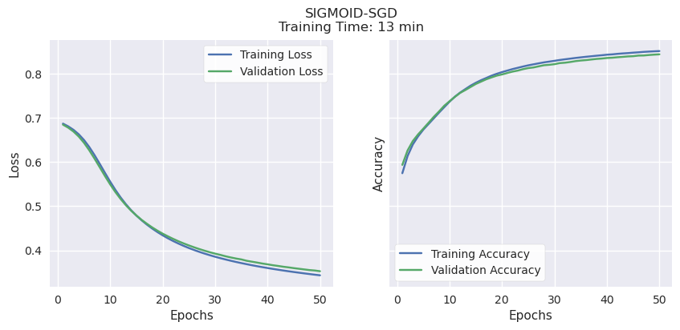
    


    
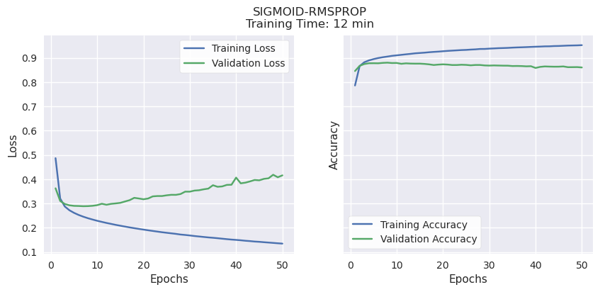
    


    
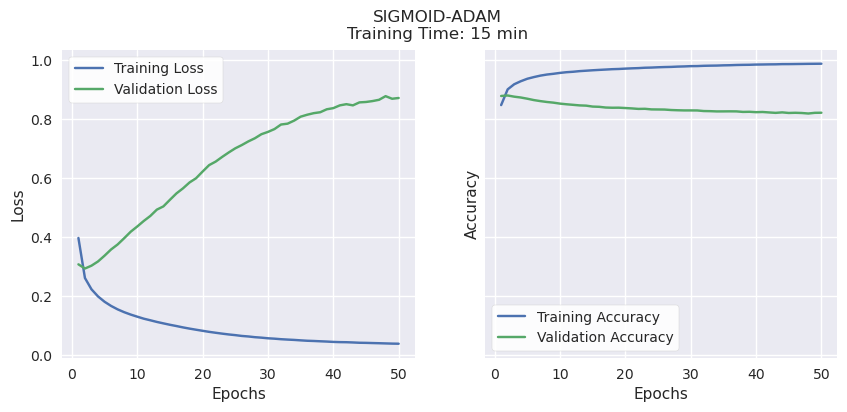
    


    
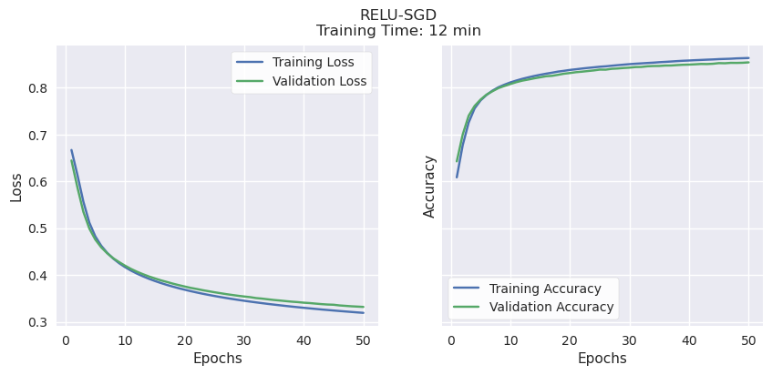
    


    
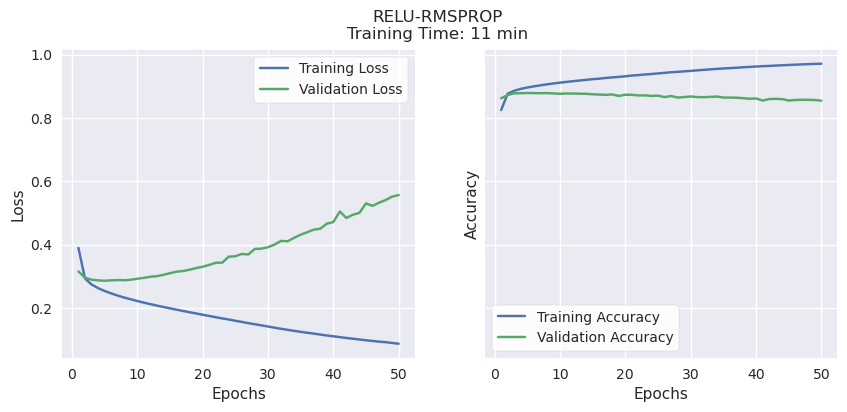
    


    
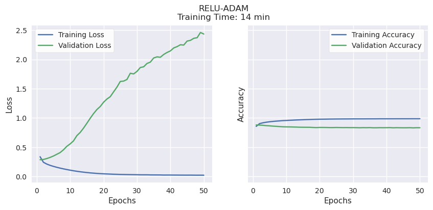
    


## Validation Accuracy, Learning Potential, and Time to Train.

RMSProp and ADAM consistently reached their peak validation accuracy of 80-85% very quickly, regardless of activation function (Sigmoid or ReLu), then began to overfit. Both have strong validation accuracy, but very little learning potential. ADAM also took a bit longer than the other methods, a few minutes per model.

> It's worth noting that these were trained using the P100 GPU accelerator available when running this notebook on Kaggle. In earlier experiments on a PC with no acceleration, the differences in time were much more pronounced: SGD consistently took less than 10 minutes, RMSProp consistently took over 20, and ADAM over 45 minutes to complete training.

SGD had comparable validation accuracy to the other optimizers (70-80%) while showing the best potential for even better accuracy. Unlike the others, both validation and training accuracy continued to rise together until the end of the training period, suggesting that it will improve if given more time and training data.

SGD with either activation function showed the highest accuracy, so we will compare the different activation functions with a response curve to explore how our final output threshold might affect results.


```python
# Define function to load a saved Neural Net model 
# and its weights, then use to make predictions based on data X
def load_nn_and_predict(path, X):
    
    model = tf.keras.models.load_model(
        os.path.join(path,"model.h5"),
        custom_objects={"KerasLayer":hub.KerasLayer})

    model.load_weights(path + "cp.ckpt")
    pred = model.predict(X)
    
    return(pred)

# Load SGD/Sigmoid and SGD/Relu models and 
# predict polarity for test set
sigmoid_pred = load_nn_and_predict(exp_path + "/sigmoid-sgd/", test["text"])
relu_pred = load_nn_and_predict(exp_path + "/relu-sgd/", test["text"])

```

    12500/12500 [==============================] - 46s 4ms/step
    12500/12500 [==============================] - 46s 4ms/step
    


```python
# Define function to generate and plot ROC curve
def plot_nn_roc_curve(title, true, pred, ax):
    
    fpr, tpr, _ = sklearn.metrics.roc_curve(true, pred)

    auc_score = sklearn.metrics.auc(fpr, tpr)

    ax.plot(fpr, tpr, label = f"AUC Area = {auc_score:.5f}")
    ax.plot([0,1], [0,1], linestyle="--")
    ax.set_title(title)
    ax.set_xlabel("False Positive Rate")
    ax.set_ylabel("True Positive Rate")
    ax.legend(loc="lower right");


# Create figure and axes
fig, (ax1, ax2) = plt.subplots(ncols=2, sharey=True, figsize=(10,4))
fig.suptitle(f"ROC Curves")

# Plot ROC curves for SGD/Sigmoid and SGD/ReLu
plot_nn_roc_curve("Sigmoid", test["polarity"], sigmoid_pred, ax1)
plot_nn_roc_curve("ReLu", test["polarity"], relu_pred, ax2)

```


    
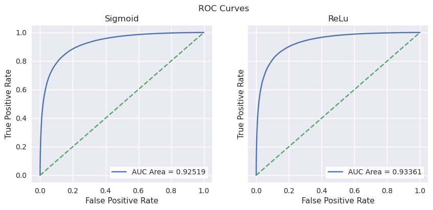
    


The ROC, or Response Object Curve, shows the trade-offs between a high True Positive rate and a False Positive rate depending on your threshold. The area under the curve is an overall measure of the precision of the model regardless of threshold. ReLu has a slight edge over Sigmoid in this respect.

Out of the 6 models attempted, using SGD as the optimizer and ReLu as the activation function in the intermediate layers has relatively high validation accuracy, the highest potential accuracy while being efficient, and is also the best independent from the output threshold we determine.

This is the specification we will use in the final model, where all the data will be used for training.

# Final Model
It's the home stretch! Here's what's being done in the following code in plain English:
- Retrieve the saved model specifications with ReLu activation in the hidden layer and SGD as the optimizer.
- Train it on the full dataset
- Save the model, weights, and training history to disk


```python
# Specify path where preferred model is saved
relu_sgd_path = r"models/experimental/relu-sgd/"

# Define new path for final model
final_model_path = r"models/final/"
```


```python
# Load neural network model architecture
# for SGD/ReLu
print("Loading model")
model = tf.keras.models.load_model(
    r"models/experimental/relu-sgd/model.h5",
    custom_objects={"KerasLayer":hub.KerasLayer})

# Save this model to the "final" model folder
model.save(final_model_path+"model.h5")

# Create a checkpoint object which will automatically save the weights
# with the highest validation accuracy as the model trains
print("Creating checkpoint object")
cp_callback = tf.keras.callbacks.ModelCheckpoint(
    filepath=final_model_path+"cp.ckpt",
    save_weights_only=True,save_best_only=True,
    monitor="val_accuracy",mode="max")

# Train Model
print("Training Model")
start = timeit.default_timer()
history = model.fit(train["text"],train["polarity"],
                    epochs=50, batch_size=256,
                    validation_data=(valid["text"], valid["polarity"]),
                    verbose=0, callbacks = [cp_callback])
stop = timeit.default_timer()

# Save training history
print("Saving training history")
history_dict = history.history
history_dict["time"] = stop - start # Add training time to history dictionary

with open(final_model_path + "history.json", "w") as f:
    json.dump(history_dict, f)
    
print("Done")
```

    Loading model
    Creating checkpoint object
    Training Model
    Saving training history
    Done
    

# Evaluate Final Model
Similar to before, I retrieve the model, weights and history from disk and examine its performance.


```python
# Read training histories for the final model
# into the dictionary
with open(final_model_path + "history.json", "r") as f:
    history_dict = json.load(f)
```


```python
# Get training time
time = history_dict["time"]

# Get the number of epochs for training
epochs = range(1, len(history_dict["accuracy"]) + 1)

 # Create figure and axes
fig, (ax1, ax2) = plt.subplots(ncols=2, sharey=True, figsize=(10,4))

fig.suptitle(f"Sigmoid-SGD\nHours of Training: {time/60/60:.2f}")

# Plot loss
ax1.plot(epochs, history_dict["loss"], "b", label="Training Loss")
ax1.plot(epochs, history_dict["val_loss"], "g", label="Validation Loss")

ax1.grid(visible=True)
ax1.set_xlabel("Epochs")
ax1.set_ylabel("Loss")
ax1.legend()

# Plot accuracy
ax2.plot(epochs, history_dict["accuracy"], "b", label="Training Accuracy")
ax2.plot(epochs, history_dict["val_accuracy"], "g", label="Validation Accuracy")

ax2.grid(visible=True)
ax2.set_xlabel("Epochs")
ax2.set_ylabel("Accuracy")
ax2.legend();
```


    
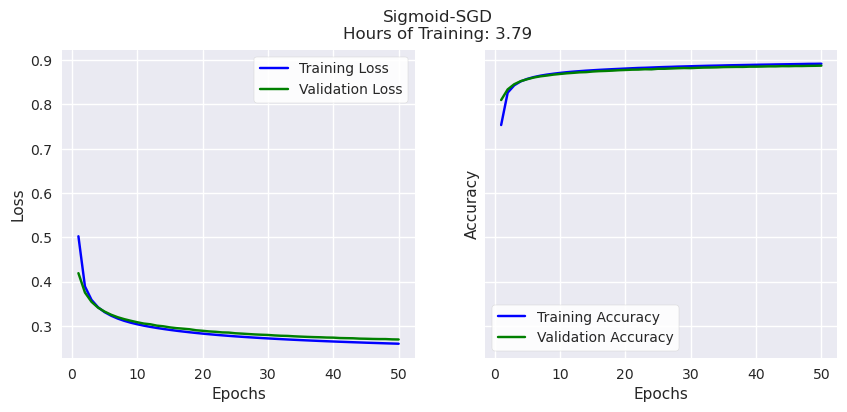
    


While training and validation accuracy never diverged (the model was not overfit) it started to plateau around 90%. It's unlikely the model would significantly exceed this figure with a longer training period.


```python
# Load model and weights, then make predictions using the test set
model = tf.keras.models.load_model(final_model_path+"model.h5",
                                   custom_objects={"KerasLayer":hub.KerasLayer})

model.load_weights(final_model_path+"cp.ckpt")

prob = model.predict(test["text"])
```

    12500/12500 [==============================] - 46s 4ms/step
    


```python
# Plot ROC Curve
fig, ax = plt.subplots()

fpr, tpr, thresholds = sklearn.metrics.roc_curve(
                        test["polarity"], prob)

auc_score = sklearn.metrics.auc(fpr, tpr)

ax.plot(fpr, tpr, label = f"AUC Area = {auc_score:.5f}")
ax.plot([0,1], [0,1], linestyle="--")
ax.set_title("RELU-SGD")
ax.set_xlabel("False Positive Rate")
ax.set_ylabel("True Positive Rate")
ax.legend(loc="lower right");

```


    
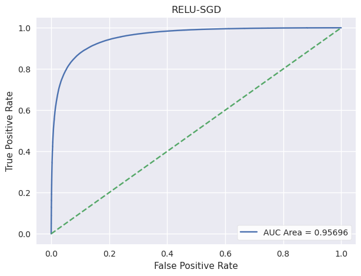
    


The area under the response curve is slightly higher, so overall our model is performing better with more data to train on.

Next, we're going to see how accuracy and recall for both classes change with different thresholds. But first, a quick transformation will be applied to make the output probabilities more practical to interpret.


```python
# Print minimum and maximum outputs from the neural network
print(np.min(prob.ravel()))
print(np.max(prob.ravel()))
```

    -34.466152
    15.068687
    

Above is the minimum and maximum polarity output by our model. I'll use a sigmoid function to coelesce these figures to between 0 and 1


```python
# Define function to apply sigmoid function to a number
def sigmoid_fun(x):
    return(1/(1 + np.exp(-x)))

# Apply sigmoid function to neural network output
prob_sigmoid = pd.Series(prob.ravel()).apply(sigmoid_fun)
```

And now I compare metrics across different thresholds


```python
# Create numpy array of thresholds
thresholds = np.arange(0.0,1.01,step=0.1).round(2)

# Initialize empty lists for accuracy,
# positive class recall and negative 
# class recall
accuracies = []
pos_recalls = []
neg_recalls = []

# Using a loop, populate empty lists
for threshold in thresholds:
    # Get prediction conditional on threshold
    tf_pred = np.where(prob_sigmoid > threshold, 1, 0).ravel()
    
    # Get difference between prediction and ground truth
    # Where difference == 0, the prediction was accurate
    difference = tf_pred - test["polarity"]
    results = difference.value_counts()
    accuracy = results.loc[0]/test.shape[0]

    # Get positive recall
    pos_num = sum((test["polarity"] == 1) & (tf_pred == 1))
    pos_den = sum(test["polarity"] == 1)
    pos_recall = pos_num/pos_den

    # Get negative recall
    neg_num = sum((test["polarity"] == 0) & (tf_pred == 0))
    neg_den = sum(test["polarity"] == 0)
    neg_recall = neg_num/neg_den
    
    # Append accuracy, positive recall and negative
    # recall to empty lists
    accuracies.append(accuracy)
    pos_recalls.append(pos_recall)
    neg_recalls.append(neg_recall)

# Assemble metrics into a dataframe for convenient plotting
tf_results_df = pd.DataFrame({"Threshold":thresholds,
                           "Accuracy":accuracies,
                           "Recall (1)":pos_recalls,
                           "Recall (0)":neg_recalls})
```


```python
# Plot TensorFlow performance
tf_results_df.plot.bar(x="Threshold",
                       title="TensorFlow Neural Network Performance")
plt.legend(loc="upper left");
```


    
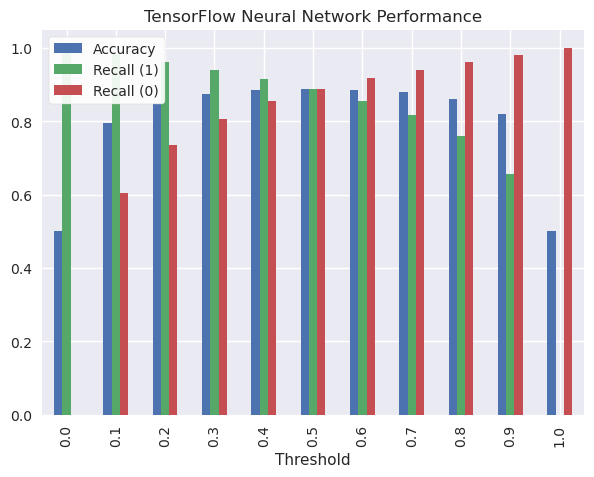
    


The most balanced result is at 0.5, so I'll print out the exact metrics when this threshold is chosen.


```python
# Print TensorFlow metrics at threshold == 0.5
display(tf_results_df[tf_results_df["Threshold"]==0.5])
```


<div>
<style scoped>
    .dataframe tbody tr th:only-of-type {
        vertical-align: middle;
    }

    .dataframe tbody tr th {
        vertical-align: top;
    }

    .dataframe thead th {
        text-align: right;
    }
</style>
<table border="1" class="dataframe">
  <thead>
    <tr style="text-align: right;">
      <th></th>
      <th>Threshold</th>
      <th>Accuracy</th>
      <th>Recall (1)</th>
      <th>Recall (0)</th>
    </tr>
  </thead>
  <tbody>
    <tr>
      <th>5</th>
      <td>0.5</td>
      <td>0.88874</td>
      <td>0.888305</td>
      <td>0.889175</td>
    </tr>
  </tbody>
</table>
</div>


To make it easier to remember, here's the same plot but for TextBlob predictions.


```python
# Plot TextBlob performance
tb_results_df.plot.bar(title="TextBlob Sentiment Analysis Performance",
                    x="Threshold")
plt.legend(loc="upper left");
```


    
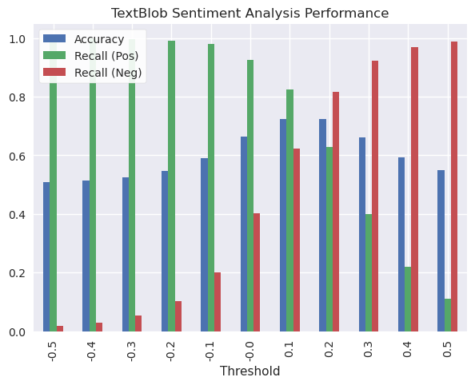
    


Once again, the most balanced results were around 0.10-0.20, so I'll print out the exact metrics for these two thresholds.


```python
# Print TextBlob metrics at threshold == 0.1 and 0.2
display(tb_results_df[tb_results_df["Threshold"]==0.1])
display(tb_results_df[tb_results_df["Threshold"]==0.2])
```


<div>
<style scoped>
    .dataframe tbody tr th:only-of-type {
        vertical-align: middle;
    }

    .dataframe tbody tr th {
        vertical-align: top;
    }

    .dataframe thead th {
        text-align: right;
    }
</style>
<table border="1" class="dataframe">
  <thead>
    <tr style="text-align: right;">
      <th></th>
      <th>Threshold</th>
      <th>Accuracy</th>
      <th>Recall (Pos)</th>
      <th>Recall (Neg)</th>
    </tr>
  </thead>
  <tbody>
    <tr>
      <th>6</th>
      <td>0.1</td>
      <td>0.723633</td>
      <td>0.82407</td>
      <td>0.623195</td>
    </tr>
  </tbody>
</table>
</div>


<div>
<style scoped>
    .dataframe tbody tr th:only-of-type {
        vertical-align: middle;
    }

    .dataframe tbody tr th {
        vertical-align: top;
    }

    .dataframe thead th {
        text-align: right;
    }
</style>
<table border="1" class="dataframe">
  <thead>
    <tr style="text-align: right;">
      <th></th>
      <th>Threshold</th>
      <th>Accuracy</th>
      <th>Recall (Pos)</th>
      <th>Recall (Neg)</th>
    </tr>
  </thead>
  <tbody>
    <tr>
      <th>7</th>
      <td>0.2</td>
      <td>0.722538</td>
      <td>0.628305</td>
      <td>0.81677</td>
    </tr>
  </tbody>
</table>
</div>


# Final Verdict
With some overnight tuning, the final model predicts whether the text of an amazon review reflects a positive or negative sentiment, and is correct 88% percent of the time. The epoch-by-epoch trend suggests that the model was approaching its peak out of sample accuracy, and likely would not go higher than 90%. This is still significantly better than Textblob, which had 75% accuracy and similar recall for both positive and negative sentiment.

With a single day of experimentation to arrive at a stronger neural network specification and training using Kaggle's GPU acceleration, a relatively simple neural net can outperform TextBlob by about 15% in terms of accuracy, if you have specific data to train on for the task at hand.

- Replicate this [here](https://www.kaggle.com/code/kfoster150/textblob-vs-tensorflow-for-sentiment-analysis)
- Check out the dataset [here](https://www.kaggle.com/datasets/kritanjalijain/amazon-reviews)
- Read the original course report <a href="https://github.com/ken-foster/ken-foster.github.io/raw/main/files/Textblob%20vs%20TensorFlow.pdf" download>here</a>
